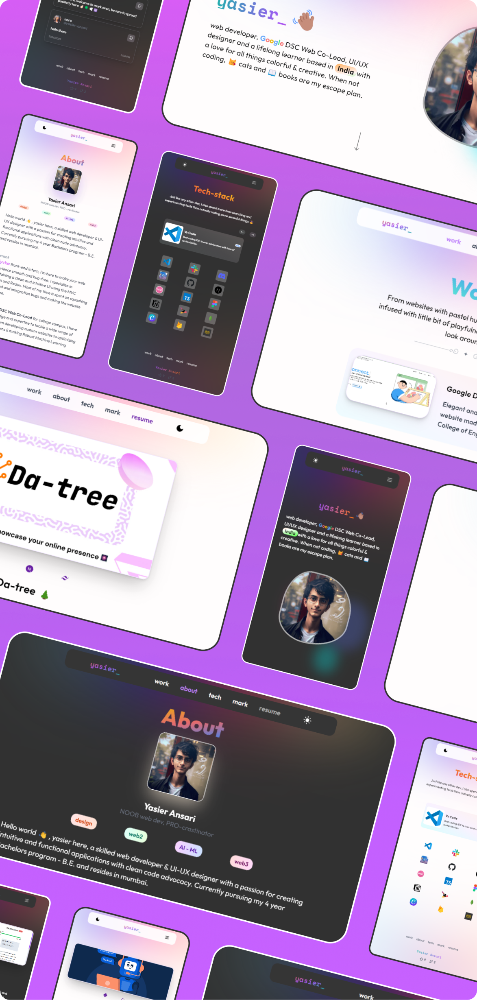
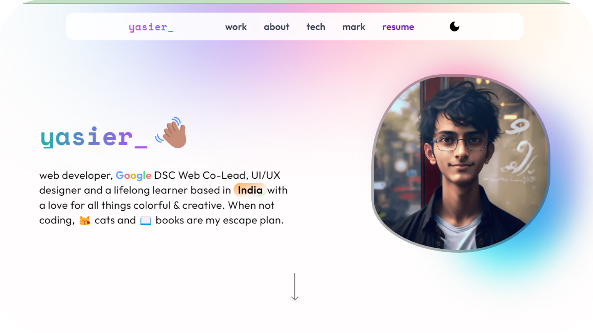

🚀 feat -
✅ fix -
📃 docs -
⚒️ refactor -
🔖 info -
🔥 style -
🧹 chores

# Pastel Joy - personal website

Hey there! Welcome to the repository of my awesome portfolio website, Pastel Joy! It's a simple and pastel-themed personal website template designed specifically for all you poppy and elegant folks out there. I built it using Next.js, Tailwind CSS, and Firebase. Excitingly, it's hosted on Vercel, and the domain was purchased from GoDaddy.
<br/>
<br/>

<p align="center" >
  
</p>
<br/>

## Table of Contents

-   [Personal Website](#personal-website) - [www.yasier.in](https://yasier.in)
    -   [Table of Contents](#table-of-contents)
    -   [About](#about)
    -   [Features](#features)
    -   [Technologies Used](#technologies-used)
    -   [Getting Started](#getting-started)
    -   [Deployment](#deployment)
    -   [License](#license)

## About

Hey there! 👋 I'm Yasier, a friendly web developer and UI/UX designer who loves creating intuitive applications with clean code. I'm currently an engineering undergraduate from "आमची MUMBAI".

I recently discovered the importance of having a professional portfolio to showcase my skills and experiences. I'm super excited to present my portfolio website, where you'll find a delightful mix of my past projects and achievements. Let's connect and explore my portfolio together!

> **Warning**
> Just a heads up, this website was built using Next.js@13.0.7 with the pages directory version. The latest Next.js@latest the /app directory, which won't work with this repo's architecture. In case you want to use the newer versions, some minor but tedious changes would be needed.

## Features

-   [x] <del> Simple yet sweet UI </del>
-   [x] <del> light-dark mode switch </del>
-   [x] <del> User Login </del>
-   [x] <del> User Post </del>
-   [ ] integrate MDX
-   [ ] inlcude personal Blog

## Technologies Used

-   [Next.js](https://nextjs.org/): An amazing React framework that makes it super easy to build dynamic websites. It's perfect for server-side rendering and creating static websites.
-   [Tailwind CSS](https://tailwindcss.com/): fantastic CSS framework that lets you build modern and stylish designs in no time.
-   [Firebase](https://firebase.google.com): A cloud platform providing various services like database and authentication.
-   [Cloudinary](https://cloudinary.com/): Image CDN for faster and customizable edited image fetching.

## Getting Started

If you're eager to run this website on your local machine, don't worry, I've got you covered! Just follow these simple steps:

-   Open your terminal and type

```
git clone https://github.com/yasier-ansari/portfolio-website.git
cd personal-webite
touch .env.local
```

-   now open the `.env.local` file and fill it with your credentials

```
NEXT_PUBLIC_CLOUDINARY_CLOUD_NAME=<YOUR-CLOUDINARY-NAME>  (check your cloudinary dashbord)
NEXT_PUBLIC_FIREBASE_API_KEY=<YOUR-FIREBASE-ENVs>
NEXT_PUBLIC_FIREBASE_AUTH_DOMAIN=<YOUR-FIREBASE-ENVs>
NEXT_PUBLIC_FIREBASE_PROJECT_ID=<YOUR-FIREBASE-ENVs>
NEXT_PUBLIC_FIREBASE_STORAGE_BUCKET=<YOUR-FIREBASE-ENVs>
NEXT_PUBLIC_FIREBASE_MESSAGING_SENDER_ID=<YOUR-FIREBASE-ENVs>
NEXT_PUBLIC_FIREBASE_APP_ID=<YOUR-FIREBASE-ENVs>
NEXT_PUBLIC_FIREBASE_MEASUREMENT_ID=<YOUR-FIREBASE-ENVs>
```

-   you prefer not to use Cloudinary, don't worry! You can use any other CDN or even the /public folder to store your images if there aren't many. But if you have a lot of images to use in your project, it's recommended to use a CDN.

-   If you don't want the user post feature on your website, simply remove the Firebase package and the mark.js file in the pages directory

#### Auth & User Post

-   Start by setting up a new Firebase project and choose "web" as your domain. Once configured, use the Firestore database. Copy your Firebase environment variables to the `.env.local` file.

-   Go to your profile developer settings and initiate an OAuth project. Generate your client secret, and copy both the client secret and client ID to your .env.local file. Give your project a name and add your homepage URL. If you're testing locally, it will be `http://localhost:3000`. If you've hosted your website on a domain, paste the domain URL in that field, `<your-domain-url>`.

-   Head back to your Firebase project and enable authentication. Choose the GitHub provider and fill in the Client ID and Client Secret. Copy the auth handler URL.

-   Return to your GitHub OAuth project and paste the auth handler URL into the "Authorization callback URL" field.

Phew! After all that hustle, you've finally integrated your Auth and User post features. Great job!

after all the above steps, you can just spin up a local server and enjoy your website

```
npm install
npm run dev
```

#### The output would be something like this

  <p align="center" >
    
  </p>

-   Now, feel free to update the text content to your liking and even change the SEO options for your testing website through the /utils/seoConfig.js file. Just be sure to replace my data with your own. Otherwise, you'll end up using my SEO, which means your site will be indexed on my domain when deployed. We don't want that, right?

---

## Deployment

To host this awesome personal website, follow these simple steps:

### 🔒 Firebase Authentication

-   Go to the Firebase authentication tab and add your domain to the "Authorised Domain" field. It's important to ensure a smooth authentication process
-   Check your Oauth project and make sure all the entry are valid, change your Homepage URL to your domain Url index page, this way , after deployment, your website wont give you any error

### 🚀 Vercel Hosting

-   Start by pushing your website code to your GitHub account.
-   Create a new Vercel project, selecting the repository you just pushed.
-   In the deployment settings, include your environment variables by pasting the contents of the env.local file.
-   If you're happy with the default Vercel domain, you're all set! Otherwise, choose a custom URL like "ginko.vercel.app" that suits your style.
-   If you've purchased a custom URL from a DNS service, set up a redirect in your vercel setting domain tab to point to your `your-custom-domain`, using a status code of 307.

Now your website is ready to shine online! ✨

## License

This project is licensed under the MIT License. I would be thrilled if you chose to use it as your personal website! If you have a moment, I'd love to hear what you enjoyed about this project and any suggestions you have for future improvements. And hey, if you need any assistance setting up your website, just let me know. I'm always here and happy to help! 😊

---
